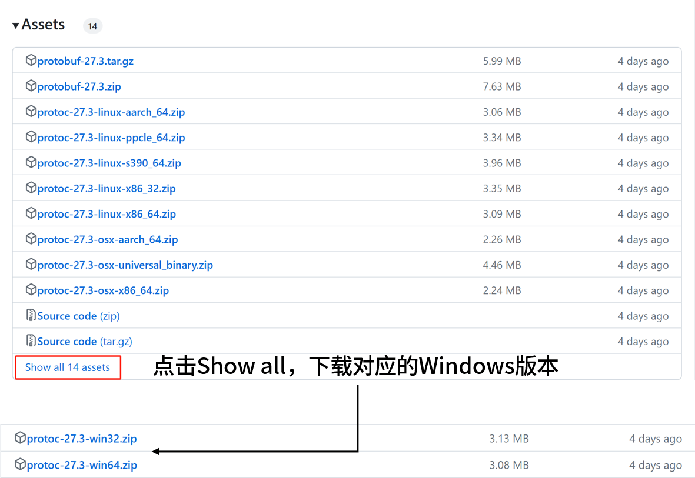

# 将proto文件转为go代码
## 1. 安装protoc
### Linux
```Shell
$ apt install -y protobuf-compiler
$ protoc --version  
```
-y等价于--yes，如果安装出现一些“确认提示”，需要你输入yes或no，-y会自动帮你输入yes，避免安装流程被中断。
### Windows
（此方法适用于所有操作系统）
到[protocolbuffers官网](https://github.com/protocolbuffers/protobuf/releases)上下载最新版的编译好的protoc可执行行文件。  

解压后有个bin目录，把它放到环境变量PATH里去，这样就可以在任意目录下使用protoc命令了。解压后还有一个include目录，不需要用它。  
### MacOS
```Shell
$ brew install protobuf
$ protoc --version  
```
## 2. 安装生成go代码的插件
```Shell
go get github.com/golang/protobuf/protoc-gen-go
go install github.com/golang/protobuf/protoc-gen-go@latest
go get google.golang.org/grpc/cmd/protoc-gen-go-grpc
go install google.golang.org/grpc/cmd/protoc-gen-go-grpc
```
这两个install命令会在你的GOPATH下对应地生成两个可执行文件protoc-gen-go和protoc-gen-go-grpc(Windows上的可执行文件以.exe结尾)，前提是你已经安装好了go开发环境，配好了GOPATH。
### 3. 将proto文件转为go代码
假设你写好了一个文件叫student_service.proto，且放在了./idl目录下。
```proto
syntax="proto3";	//采用protobuffer V3版本的语法编写

package idl;	//等同于go语言package的功能

option go_package = "./idl/my_proto;student_service";	//分号前面是生成的go文件所在有路径，.是--go_out指定的路径，分号后面是生成的go文件package名称

message Student {  //等同于go语言的struct
	string name = 1;	// 变量名的驼峰形式就是go里的成员变量名。后面的数字来用来作pb序列化，每个成员变量对应的数字需要唯一
	repeated string Locations = 4;	//repeated表示list
	map<string,float> Scores = 3;	//map
	bool Gender = 5;
	int32 Age = 6;		//int32或int64
	float Height = 7;	//转成go语言是float32
}

message Request {
	string StudentId = 1;
}

service StudentService { //等同于go语言的接口，接口里可以定义多个函数
    rpc GetStudentInfo (Request) returns (Student);  //指定函数名、入参类型、出参类型
}
```
通过以下命令把proto文件转为go文件：  
```Shell
protoc --go_out=./grpc --go-grpc_out=./grpc --proto_path=./grpc/idl  student_service.proto
go mod tidy
```
- --go_out指定student_service.pb.go的输出路径，--go-grpc_out指定student_service_grpc.pb.go的输出路径，注意要再加上go_package分号前面的部分。
- --proto_path指定proto文件所在的路径。
- 在windows上路径里不要包含中文，如果路径里包含空格则路径要放在""中。
- go mod tidy 是为了自动引入所需依赖。