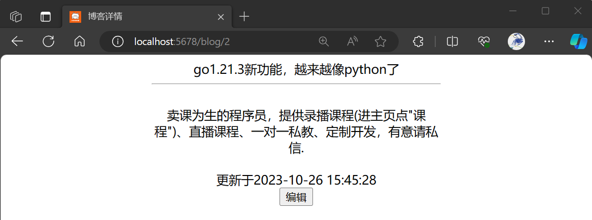
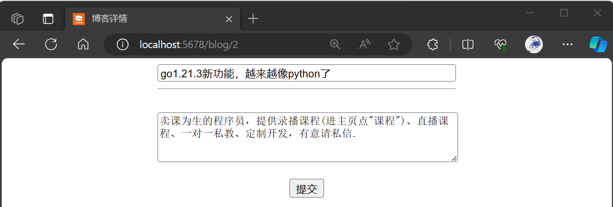

<style type="text/css">
img {
    display: block;
    float: none;
    /* margin-left: auto;
    margin-right: auto; */
}
</style>

{width="800"}
# 理解业务，设计数据库
## 产品交互逻辑
一共4个页面。
{width="600"}
{width="600"}

url里传userid，就可以看某作者的博客列表。
{width="600"}
如果当前浏览者就是作者，则显示“编辑”按钮。
{width="600"}
虽然正常情况下非作者进入不到编辑页面，但为了防止直接调接口提交，所以后端要再校验一下提交者是不是作者本人。
## 系统设计
{width="500"}
### js存储数据的3种方式
|存储形式|谁可以使用|何时失效|
| :--- | :--- | :--- |
|cookie|同domain下，跟protocol和port无头。如果不指定domain则默认为本host(如b.a.com)，如果指定的domain是一级域名(如a.com)，则二级域名(b.a.com)下也可以访问|可设置有效期，如果不设则默认浏览器关闭后失效|
|sessionStorage|仅当前浏览器Tab页内，且同源(domain/port/protocol)|切换Tab或重启浏览器|
|localStorage|同源(domain/port/protocol)|手动清除浏览器数据|  

{width="800"}
### 基于cookie的身份认证
1. 用户登录成功后服务端把<token: user_info>存入Redis，并通过Set-Cookie的形式把token返回给浏览器 
{width="800"}
2. 浏览器后续的所有请求会自动把同域名下的cookie放到RequestHeader里（无需在js代码里手动传参）
{width="800"}
3. 服务端从RequestHeader里取得token，如果能从redis上取得相应的user_info就认证通过

在[《爬虫与反爬虫》](https://www.bilibili.com/cheese/play/ss5454)课程的bilibili_comment.go代码里就是直接从浏览器里拷贝出登录之后的cookie，放到go代码里然后去请求bilibili的评论接口。
每次认证都需要读一次Redis。
### 基于JWT的身份认证
1. 服务端把user_info以明文形式编码到一个token里返回给客户端，server用自己的密钥可以校验该信息是否被篡改过
2. 后续凡是需要验证身份的操作，客户端都需要回传token，服务端从token中反解出user_info

考虑JWT token存到哪儿合适。
1. localStorage数据不存在过期的概念，所以“N天需重新登录”的业务需求需要由JWT本身的Expiration来实现，即每次后端接口都要判断一下JWT是否过期。存在的问题：用户一直在同一个浏览器Tab内操作，如果刚好到JWT过期的临界点，就会强行被重定向到登录页面。
2. cookie虽然有过期的概念，但如果刚好到过期的临界点，也会存在用户“突然”被强行登录的情况。
3. 存到sessionStorage中虽然用户不会“突然”被强行登录，但新打开一个标签、或重新打开浏览器，录信息就会丢失。
### 双token认证
{width="600"}
整体思路：不依赖JWT的Expiration功能，JWT还是存到sessionStorage里，session关闭后下一次可通过cookie里的refresh_token重新获取jwt。
1. 服务端生成jwt的同时生成另外一个随机字符串(称为refresh_token)，一并返回给客户端。服务端需要把refresh_token和jwt_token(或称为auth_token)的对应关系存入Redis
2. JWT token存到sessionStorage中，不用考虑大小限制；refresh_token存到cookie中，设置refresh_token的过期时间为下次强制登录的时间
3. 在取不到JWT token的情况上（比如重启浏览），浏览器拿refresh_token去向服务端索取JWT token，然后把JWT token再存入sessionStorage。只要不关闭浏览器，即使超过了很多天也不需要重新登录

跟基于cookie的身份认证方式相比，双token方案减少了读Redis的频次。

## 建表
登录数据库
```shell
mysql -h localhost -P 3306 -u root -p
```
建库建表
```sql
show databases;
create database blog;
create user 'tester' identified by '123456';
grant all on blog.* to tester;
use blog;
create table if not exists user(
	id int auto_increment comment '用户id，自增',
	name varchar(20) not null comment '用户名',
	password char(32) not null comment '密码的md5',
	primary key (id),
	unique key idx_name (name)
)default charset=utf8mb4 comment '用户登录';
insert into user (name,password) values 
    ("dqq","e10adc3949ba59abbe56e057f20f883e"),
	("dlm","e10adc3949ba59abbe56e057f20f883e");
create table if not exists blog(
	id int auto_increment comment '博客id',
	user_id int not null comment '作者id',
	title varchar(100) not null comment '标题',
	article text not null comment '正文',
    create_time datetime default current_timestamp comment '创建时间',
    update_time datetime default current_timestamp on update current_timestamp comment '最后修改时间',
	primary key (id),
	key idx_user (user_id)
)default charset=utf8mb4 comment '博客内容';
insert into blog (user_id,title,article) values (1,"笠翁对韵  一东","云对雨，雪对风，晚照对晴空。来鸿对去雁，宿鸟对鸣虫。三尺剑，六钧弓，岭北对江东。人间清暑殿，天上广寒宫。两岸晓烟杨柳绿，一园春雨杏花红 。两鬓风霜，途次早行之客。");
insert into blog (user_id,title,article) values (1,"go1.21.3新功能，越来越像python了","玉露凋伤枫树林，巫山巫峡气萧森。江间波浪兼天涌，塞上风云接地阴。丛菊两开他日泪，孤舟一系故园心。寒衣处处催刀尺，白帝城高急暮砧。");
insert into blog (user_id,title,article) values (1,"通用微服务框架的基础功能，暨微服务课程介绍","戍鼓断人行，秋边一雁声。露从今夜白，月是故乡明。有弟皆分散，无家问死生。寄书长不避，况乃未休兵。");
exit;
```
- 在任何地方都不要存储用户的密码。
- 指定utf8编码，否则中文不能正常显示，mb4兼容emoji表情符号。
- char和varchar里数字的单位是"字符"，在utf8编码集下一个英文字母和一个汉字都算一个"字符"。
- 所以列及表都要写注释，一定有其他人需要看这个注释。
- 业务上必须赋值的字段设置为not null。
- 根据业务的查询需求创建索引，索引越多DB的资源开销越大，写数据速度越慢。
- 业务上不允许出现重复记录时，用unique key，有时候unique key是联合索引。

# go代码
## 初始化项目
```shell
cd d:/go_project
mkdir blog
cd blog
go mod init blog
```
所有go代码在blog目录下，module的名称也叫blog，注意目录名和module名可以不同，在go代码的import语句里第一个/之前的内容是module名而非目录名。
打开vscode，菜单栏点击“文件->打开文件夹”，选择d:/go_project/blog。在vscode左侧资源管理器空白处右键，新建文件夹，建立如下目录结构。
{width="400"}
- config: 配置文件。比如连接数据库的账号信息，logger的控制信息
- util: 通用的基础函数。比如logger、哈希算法
- database: 所有跟数据库查询、修改相关的代码
- handler: http后端接口实现
  - middleware: 中间件。比如鉴权认证、监控上报。中间件本质上也是一种handler
- views: 前端页面
复杂的项目可能还要创建其他目录。<b>总之，把功能相似的代码放在一个目录，形成自己的风格就好，不必刻意遵守某一种项目分层规范。</b>代码分目录时要考虑到将来不能出现循环import。
## 依赖管理
在项目中引入依赖。在go.mod同一级目录下执行
```shell
go get github.com/spf13/viper
```
会把`https://github.com/spf13/viper`代码下载到${GOPATH}/pkg/mod目录下，同时加入到go.mod的require条目里。go项目通过go.mod完成依赖管理，require里会标明依赖的第三方库的版本号，“版本号”对应的是git tag的名称。
{width="500"}
如果是很久之前下载过viper，可以更新到最新版本。
```shell
go get -u github.com/spf13/viper
```
也可以强制指定使用特定的版本。
```shell
go get github.com/spf13/viper@v1.15.0
```
这样在go.mod的require里面依赖的就是v1.15.0这个版本的viper。
## 配置文件
Viper可以解析JSON、TOML、YAML、HCL、INI、ENV等格式的配置文件。甚至可以监听配置文件的变化(WatchConfig)，不需要重启程序就可以读到最新的值。
可以通过Get系列函数按路径读取配置，也可以通用Unmarshal把配置文件解析为结构体。
系统初始化阶段发生任何错误，直接结束进程。
## logger
LogRus可以：
1. 设置日志级别
2. 显示日志输出的位置
3. 自定义日志里的时间格式
4. 按特定时间周期、或文件大小切分日志文件
5. 自动删除太老的日志文件
6. 日志文件带时间后缀 

在[《I/O进阶编程》](https://www.bilibili.com/cheese/play/ss5925)这门课程里自己实现了一个logger，功能齐全，性能比LogRus快10倍。
## DB
- 通过gorm.open()获得的*DB是数据库连接池，而非一个连接，所以该*DB用单例即可。通过SetMaxOpenConns()设置最多同时建立多少个连接，如果并发请求数多于该值则后到的请求要阻塞；当池子中空闲的连接超过阈值时，超- 出的部分会被关闭掉，该阈值通过SetMaxIdleConns()指定。
- gorm有自己的日志体系，可以把普通日志关掉，仅开启慢查询等警告日志，或者设置日志级别为Slient关掉所有日志。
- 开启PrepareStmt，使用SQL预编译提高查询效率。
- 仅Select需要的字段。通过反射获取所有字段，避免将来往struct里加字段后忘了改Select()的参数。
- 通常遇到gorm.ErrRecordNotFound错误不需要打日志。  

登录之后的身份认证需要用到Redis。什么时候适合用Redis?
1. 高并发，低延时。redis比mysql快一到两个数量级。
2. redis可靠性没mysql高，万一redis挂了对业务影响不大（大不了让用户重新登录一次），好修复。
3. redis通常存储string型value，此时它相对于mysql的性能优势更明显。

更多数据库调优经验参见[《go数据库编程大全》](https://www.bilibili.com/cheese/play/ss5727)。
## 后端接口
|请求路径|请求方式|请求参数|请求header|说明|
| :--- | :--- | :--- | :--- | :--- |
|/login|GET|||返回登录页面，让用户输入用户名和密码|
|/login/submit|POST|{user:xxx, pass:xxx}||pass需要在客户端执行哈希之后再传给服务端。返回UserId和auth_token(JWT)，同时在Response Header里包含一条Set-Cookie: refresh_token=xxx|
|/token|POST|{refresh_token:xxx}||auth_token|
|/blog/belong|GET|{bid:blog_id,token:auth_token}||根据blog_id从数据库里取得对应的user_id，再从auth_token(jwt)里反解出userid，如果两个user_id相同，则返回"true"，否则返回"false"。在博客详情前端需要调用该接口，以此来判断是否展示编辑按钮|
|/blog/list/:uid|POST/GET|uid||返回该用户发布的所有博客|
|/blog/:bid|GET|bid||返回博客的详细信息|
|/blog/update|POST|{bid:博客ID, title:博客标题, article:博客正文}|auth_token=xxx|确保当前登录用户是作者本人，然后修改博客|  

只要不关闭浏览器且不切换浏览器窗口，就一直用不上refresh_token；当auth_token丢失后才需要从cookie里取出refresh_token，调“/token”接口重新获取auth_token。  
### 关于GIN
1. GIN认为一个url同时支持GET和POST是"不合理"需求，如果非要这么做就写2行代码
2. GIN自带logger和recover中间件，logger的输出位置通过gin.DefaultWriter指定，指定为io.Discard则禁用logger。grpc需要自己写recover拦截器
3. 上线的时候改为线上发布模式gin.SetMode(gin.ReleaseMode)
4. 通过Use可以设置全局中间件；也可以路由分组，按组设置中间件；还可以给某个接口单独设置中间件，因为中间件本质上就是一个Handler

## 前端展现
1. 对密码执行哈希运算时依赖 `http://code.jquery.com/jquery-latest.js` 和 `https://cdnjs.cloudflare.com/ajax/libs/crypto-js/3.1.2/rollups/md5.js` 
2. 登录成功后，取到auth_token，把它存到sessionStorage里（window.sessionStorage.setItem(k,v)）
3. 登录成功后，自动跳转到本人的博客列表页（window.location.href=xxx或者window.location.replace()）
4. 后端返回博客列表，前端通过go template遍历每一篇博客，动态生成html元素（{{range }}）
5. 在博客详情页，展现和修改是两个重叠的div，显示一个（style.display='block'）隐藏另一个（style.display='none'）
6. 编辑按钮默认没有，通过js判断是作者本人后动态地往html里插入一个元素（这里是通过js而非go template）
7. 通过ajax提交博客修改时，在beforeSend回调函数里把auth_token放入RequestHeader中（request.setRequestHeader(k,v)）
8. 后端传回的值如果前端不需要展现，可以把它放到一个隐藏的元素里，在js里读取该元素的值（比如#bid）

## 监控
> 跳出程序员思维
> <b>可用性是最重要的，性能是不怎么重要的，技术先进不先进是无所谓的。</b>
> 服务好用户，给公司创造价值，才是最终目的。  

监控是保证可用性的重要手段。接口的QPS和延时是最基础的2个监控指标，放在全局中间件里进行统一监控。指标数据放到Prometheus时序数据库里，用Grafana做展现和报警，详细使用方法参见[《微服务框架》](https://www.bilibili.com/cheese/play/ss6611)。
{width="800"}  
```
rate(request_counter{service="blog",interface!~"(/metrics)|.*\\.js|.*\\.ico"}[5m])
```

```
request_timer{service="blog",interface=~"(/blog).*|(/login).*"} 
```

# 打Tag上线
```shell
git add .
git commit -m"客户端手动在header中设置token"
git tag -a v0.9 -m"客户端手动在header中设置token"
git push origin v0.9
```
在git里，tag是一个有特殊意义的branch，它代表完成某一个功能，且经过了严格的测试。有些公司要求必须用Tag上线，回滚时指定tag版本号即可，其实普通branch也可按commit版本号回滚。
tag理论上可以是任意字符串，不一定是"Vxx.xx.xx"的形式。